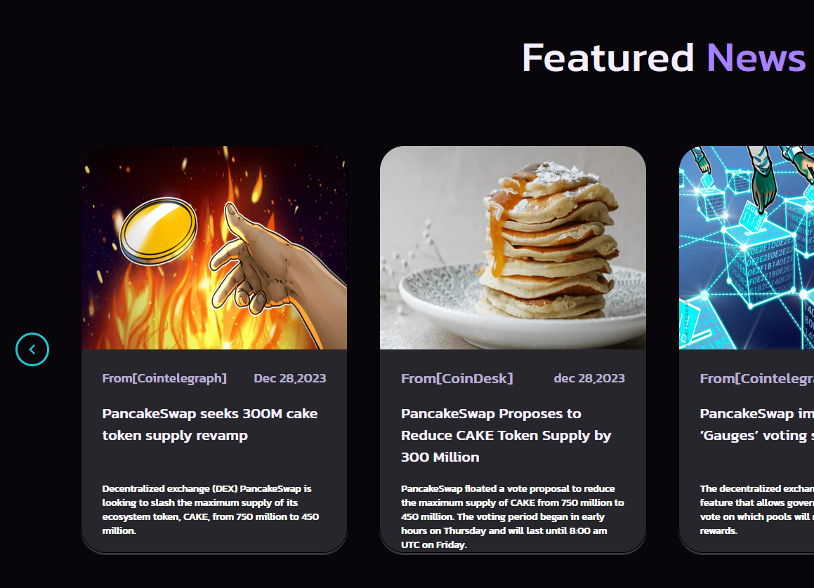
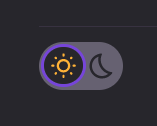
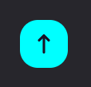

<!-- PROJECT LOGO -->
 

    
  <h3 align="center">PancakeSwap</h3>

<!-- TABLE OF CONTENTS -->

  
Contenuti

  <ol>
    <li>
      <a href="#about-the-project">The Project</a>
        <li><a href="#built-with">Built With</a></li>
    </li>
    <li><a href="#contributing">Contributing</a></li>
  </ol>

<!-- ABOUT THE PROJECT -->

## The Project

Nella parte superiore della pagina si trova la NavBar (Menù), con una serie di menù a discesa che di seguito analizziamo.

 A sinistra, dopo il logo e la scritta di PancakeSwap, sono presenti cinque menù a discesa o dropdown: Trade, Earn, Game, NFT e •••, con le rispettive opzioni. A destra, passando il mouse sull’icona globo è possibile scegliere tra le varie lingue che si aprono in dropdown (anche in fondo alla pagina nel footer). A seguire l’icona delle impostazioni, e BNB Chain  con l’elenco di varie criptovalute. 

</img>

Cliccando sulle frecce posizionate a destra e sinistra delle card è possibile farle scorrere in un verso o in un altro.

     Nella parte inferiore del sito è presente il bottone che cambia il tema del sito da darkmode a light mode.</img>

 

 

 A destra si trova il tasto di scorrimento verso l’alto, che riporta la pagina alla parte superiore del sito. 
 

 
 
 

<!-- BUILT WITH -->

### Built With

- HTML
- CSS
- JavaScript

<!-- CONTRIBUTING -->

## Contributing

Realizzato da :

<ul>
<li><h4>Anna Giusi Volpe</h4></li>
<li><h4>Alessandro Castelli</h4></li>
<li><h4>Benedetto Miceli</h4></li>
<li><h4>Chiara Paluzzi</h4></li>
<li><h4>Chiara Rapisardi</h4></li>
</ul>

Project Link: [https://github.com/Annagiusi96/pancakeswap]

